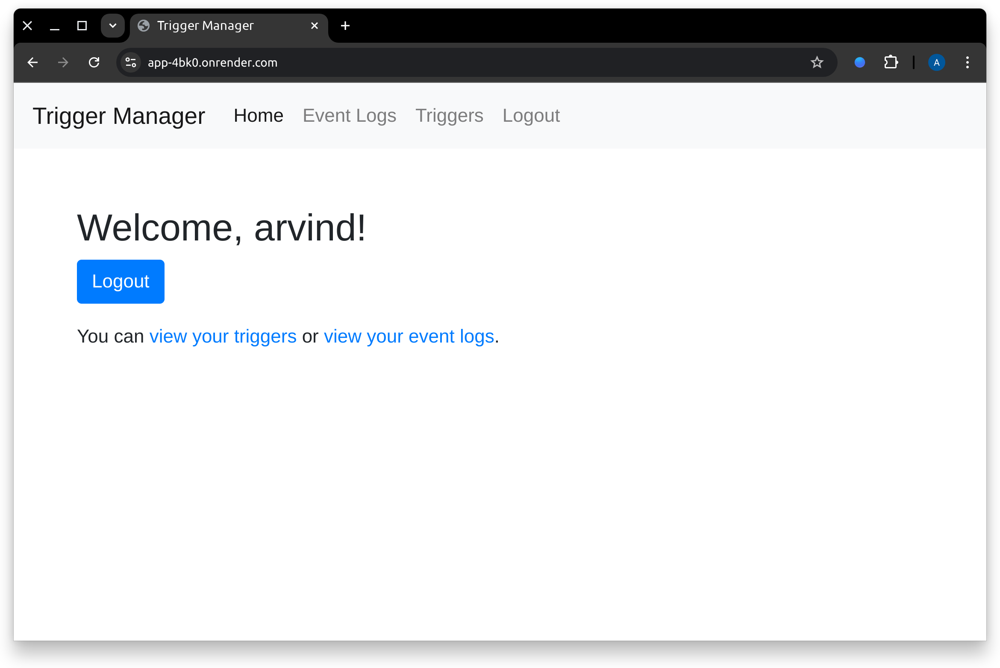

# trigger scheduler

A django app that helps with scheduling trigger for a particular period of time.

## 📸 Screenshots:

<div align="center">

</div>

## Tech Stack

- Python
- Django
- Bootstrap
- Postgres SQL
- Redis
- Celery

## Run it locally

- Clone the project

```bash
mkdir cd ~/Dev/trigger-scheduler -p
cd ~/Dev/trigger-scheduler
git clone https://github.com/arvind-4/trigger-scheduler.git .
```

- Go to the project directory

```bash
cd ~/Dev/trigger-scheduler
```

If using docker, just run the command to get started

```bash
docker compose up --build
```

Manual Set-up

- Create a virtual environment
- Install dependencies
- Copy the envs
- Set up postgres
- Set up redis
- Set up Celery worker
- Set up Celery Beat
- Run the python server

Copy the `.env.docker` file to `.env`

```bash
python3.10 -m virtualenv venv
source venv/bin/activate
pip install -r requirements.txt
# Run the celery worker
celery -A backend.celery:app worker -l info
# Run the celery beat
celery -A backend.celery:app beat -l info
# Run the python server
python manage.py runserver
```

The cost of running the server is currently free, but my approach is somewhat hacky. A more efficient solution would be to use an EC2 instance or any VM to host it at a lower cost.

## Authors

[@Arvind](https://www.github.com/arvind-4)
